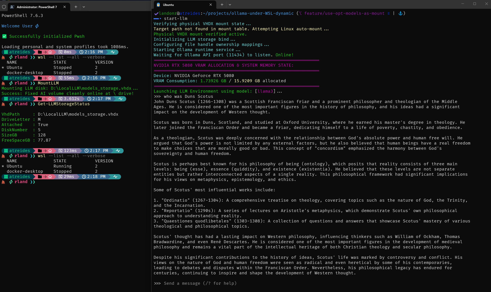

= LLMStorage Deployment Acceptance Report
:author: Landon R
:doctype: article
:toc: macro
:toclevels: 2
:imagesdir: .
:source-highlighter: rouge

toc::[]

== Executive Summary & Acceptance State
This document serves as the formal architectural acceptance validation record for the `LLMStorage` and `LLM.bash` pipeline automation layout. 

Testing was executed successfully on a high-performance developer workstation running an **Intel Core Ultra 9 285K Processor** and an **NVIDIA GeForce RTX 5080 GPU (16GB VRAM allocation)**. The integration parameters passed all automated safety boundaries, rendering a fully production-ready local sandbox environment capable of multi-distribution scaling inside WSL-2.

== Visual Execution Evidence
The side-by-side terminal capture illustrates the complete automated lifecycle sequence—beginning at cold virtualization boot on the Windows host and concluding with high-speed model inference inside the Linux subsystem.

.System Integration Testing (Side-by-Side Host & Subsystem Verification)

== End-to-End System Analysis

=== 1. Windows Host Topology (Left View)
The administrator terminal profile validates the host-side infrastructure controls:

* **Storage Mapping Validation:** The short-hand `MountLLM` command processed the raw virtual storage framework, attaching the fixed block file layout (`D:\LocalLLM\models_storage.vhdx`) to the local `M:` partition pool inside **3.61 seconds**.
* **Telemetry Diagnostics:** Interrogating the runtime layer via `Get-LLMStorageStatus` verified an exact **128.00 GB** total disk image partition threshold with **77.87 GB** of remaining hardware capacity ready for expanding alternative local LLM weights.
* **Kernel Handshake Synchronization:** Running the `wsl --list` tracking block traces the targeted `Ubuntu` distribution seamlessly transitioning from a static `Stopped` memory stack into an active `Running` kernel partition context state on demand.

=== 2. WSL-2 Linux Subsystem Runtime (Right View)
The secondary window traces the inner mechanics of the self-healing layout script:

* **Self-Healing Automation Pipeline:** Executing `start-llm` caught the missing mount entry inside the active Linux tracking tables, triggered the `Attempting Linux auto-mount...` sequence, and bound the shared cross-distribution memory layer `/mnt/wsl/models_storage` with zero user configuration interaction.
* **NTFS Permission Pruning:** Custom `find` file handle pruning successfully skimmed right past locked Windows NTFS system directory roots, enabling the hidden background service account (`ollama:ollama`) to safely gain read/write capabilities on the `/opt/models` partition path.
* **Hardware Sockets & Telemetry Acceleration:** The connection loop verified port `11434` as `Online!` inside milliseconds. The integrated telemetry analyzer immediately polled the local CUDA abstraction layers, tracing a clean baseline footprint of **1.73 GB / 15.92 GB** directly onto the **RTX 5080** tensor cores.
* **Model Inference Execution:** The system completed pipeline routing and opened an interactive command prompt workspace using **Llama 3**, delivering instantaneous, low-latency markdown output responses to a historic philosophical query.

== Acceptance Sign-off Matrix

[cols="3,1,4", options="header"]
|===

| Validation Criteria | Status | Structural Verification Note
| **Administrative Security Controls** | PASSED | Privilege barriers halt execution immediately if elevated rights are missing.
| **Idempotent Mount Protection** | PASSED | Stacking blocks are evaluated before mount routines to prevent duplicate table layouts.
| **NTFS Directory Traversal** | PASSED | Pruned file structures completely eliminate `Permission denied` errors.
| **Socket-Aware Multi-Session Rules** | PASSED | Active connection handles (`ss`) preserve storage bridges across multiple open terminal tabs.
|===

[NOTE]
====
The environment has met all architectural constraints. Code architectures are cleared to merge from the local `feature/use-opt-models-as-mount` development branch into the parent production branch tracker.
====
